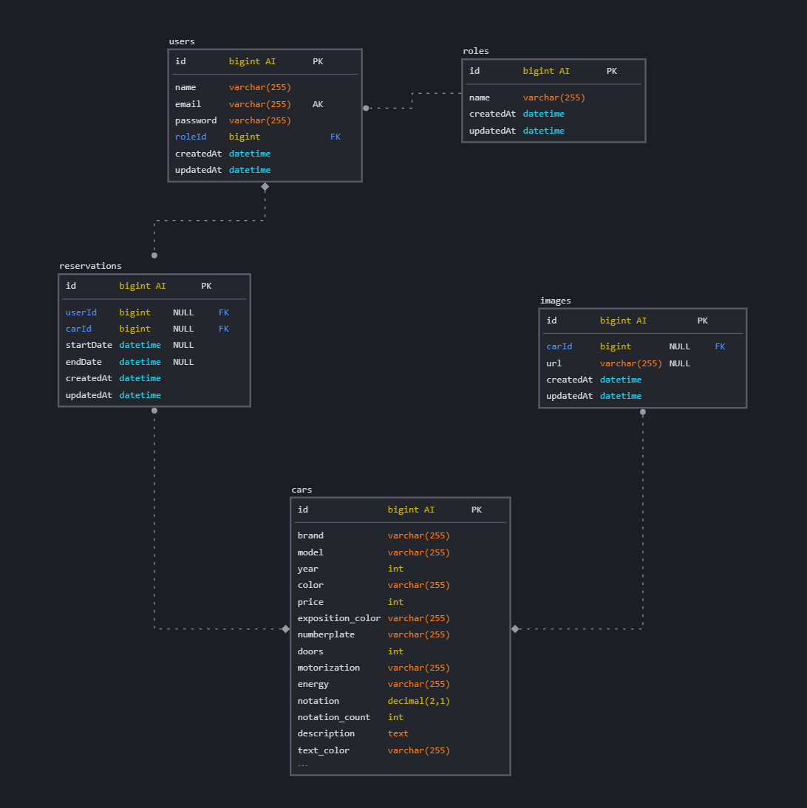

# Dockerized Booking car service

This is a personal project to practice docker with nodejs and mysql.

# Setup

## Requirements

Make sure you have installed **docker**, **docker-compose** and **pnpm**.

## Run

```bash
$ git clone
$ cd booking-car-service
$ docker build -t booking-car-service .
$ docker-compose up -d
```

# Usage

Before using the service, you will need to create a `.env` file with the following variables:

<!-- TODO: make docker look at node_env -->

```
PORT = 8080

DB_HOST = express_car_db
DB_USER = root
DB_PASSWORD = secret
DB_NAME = carsexpress
DB_PORT = 3306
```

# Endpoints

## POST /register

-   Body (json)

    ```json
    {
    	"email": "john.doe@email.com",
    	"password": "password"
    }
    ```

-   Response 200 (json)

    -   Body

        ```json
        {
        	"access_token": "your_access_token"
        }
        ```

-   Response 400 (json)

    -   Body

        ```json
        {
        	"error": "Bad Request"
        }
        ```

## GET /cars

-   Response 200 (json)

    -   Body

        ```json
        [
        	{
        		"id": 1,
        		"model": "Twingo",
        		"brand": "Renault",
        		"price": 17,
        		"notation": "1.6",
        		"description": "la petite voiture citadine agile et à la pointe de l'élégance",
        		"exposition_color": "#A8C5CE",
        		"text_color": "#000000",
        		"images": [
        			{
        				"id": 1,
        				"url": "https://renault.nicolasgwy.dev/assets/images/cars/CLIO_presentation2.png"
        			}
        		]
        	},
        	{
        		"id": 2,
        		"model": "CLio",
        		"brand": "Renault",
        		"price": 17,
        		"notation": "3.2",
        		"description": "l'iconique voiture citadine continue de vous surprendre",
        		"exposition_color": "#27385d",
        		"text_color": "#ffffff",
        		"images": [
        			{
        				"id": 2,
        				"url": "https://renault.nicolasgwy.dev/assets/images/cars/CLIO_presentation2.png"
        			}
        		]
        	}
        ]
        ```

-   Response 500 (json)

    -   Body

        ```json
        {
        	"error": "Internal Server Error"
        }
        ```

    s

## GET /cars/:id

-   Params (json)

    ```json
    {
    	"id": 3
    }
    ```

-   Response 200 (json)

    -   Body

        ```json
        {
        	"id": 3,
        	"brand": "Renault",
        	"model": "Capture",
        	"year": 2016,
        	"color": "Red",
        	"price": 17,
        	"exposition_color": "#943031",
        	"numberplate": "BB-123-BB",
        	"doors": 5,
        	"motorization": "1.9 TDI",
        	"energy": "diesel",
        	"notation": "0.5",
        	"notation_count": 50,
        	"description": "l'iconique voiture citadine continue de vous surprendre",
        	"text_color": "#ffffff",
        	"design_title": "Élégante et séduisante",
        	"design_description": "lignes sensuelles, profil dynamique, flancs sculptés et nouvelle signature lumineuse avec éclairage full LED... Dès le premier regard, Clio séduit par son style. Également disponible en full hybride, Clio s’adapte à vos envies.",
        	"equipment_title": "Pour vous faciliter la conduite au quotidien",
        	"equipment_description": "avec 3 ans de connectivité offerte, le système multimédia Easy link vous simplifie la vie grâce à son moteur de recherche d’adresses Google, son service de navigation connectée TomTom et les mises à jour automatiques.",
        	"createdAt": "2022-12-27T21:56:48.000Z",
        	"updatedAt": "2022-12-27T21:56:48.000Z",
        	"images": [
        		{
        			"id": 3,
        			"carId": 3,
        			"url": "https://renault.nicolasgwy.dev/assets/images/cars/CLIO_presentation2.png",
        			"createdAt": "2022-12-27T21:56:48.000Z",
        			"updatedAt": "2022-12-27T21:56:48.000Z"
        		}
        	]
        }
        ```

    ```

    ```

-   Response 500 (json)

    -   Body

        ```json
        {
        	"error": "Internal Server Error"
        }
        ```

-   Response 400 (json)

    -   Body

        ```json
            {
                "error": "No id provided" ||
                "error": "Invalid id" ||
                "error": "Invalid id type" ||
            }
        ```

## POST /car

-   Request (json)

    -   Body

        ```json
        {
        	"brand": "Renault",
        	"model": "Clio",
        	"year": 2016,
        	"color": "Red",
        	"price": 17,
        	"exposition_color": "#943031",
        	"numberplate": "BB-123-BB",
        	"doors": 5,
        	"motorization": "1.9 TDI",
        	"energy": "diesel",
        	"notation": "0.5",
        	"notation_count": 50,
        	"description": "l'iconique voiture citadine continue de vous surprendre",
        	"text_color": "#ffffff",
        	"design_title": "Élégante et séduisante",
        	"design_description": "lignes sensuelles, profil dynamique, flancs sculptés et nouvelle signature lumineuse avec éclairage full LED... Dès le premier regard, Clio séduit par son style. Également disponible en full hybride, Clio s’adapte à vos envies.",
        	"equipment_title": "Pour vous faciliter la conduite au quotidien",
        	"equipment_description": "avec 3 ans de connectivité offerte, le système multimédia Easy link vous simplifie la vie grâce à son moteur de recherche d’adresses Google, son service de navigation connectée TomTom et les mises à jour automatiques."
        }
        ```

-   Response 201

-   Response 400 (json)

    -   Body

        ```json
        {
        	"error": "Must provide all fields"
        }
        ```

-   Response 500 (json)

    -   Body

        ```json
        {
        	"error": "Internal Server Error"
        }
        ```

## PATCH /cars/:id

-   Params (json)

    ```json
    {
    	"id": 1
    }
    ```

-   Request (json)

    -   Body

        ```json
        {
        	"brand": "Audi",
        	"model": "A3",
        	"year": 2019,
        	"color": "red",
        	"price": 1000,
        	"exposition_color": "#ff0000",
        	"numberplate": "AB123CD",
        	"doors": 5,
        	"motorization": "1.6 TDI",
        	"energy": "Diesel",
        	"images": [
        		{
        			"id": 1,
        			"name": "image1.jpg",
        			"base64": "Base64 image String"
        		},
        		{
        			"id": 2,
        			"name": "image2.jpg",
        			"base64": "Base64 image String"
        		}
        	]
        }
        ```

-   Response 200

-   Response 400 (json)

    -   Body

        ```json
        {
        	"error": "No update fields provided"
        }
        ```

-   Response 500 (json)

    -   Body

        ```json
        {
        	"error": "Internal Server Error"
        }
        ```

## DELETE /cars/:id

-   Params (json)

    ```json
    {
    	"id": 1
    }
    ```

-   Response 200

-   Response 500 (json)

    -   Body

        ```json
        {
        	"error": "Internal Server Error"
        }
        ```

## POST /cars/:id/image

-   Params (json)

    ```json
    {
    	"id": 1
    }
    ```

-   Body (json)

    ```json
    {
    	"name": "image1.jpg",
    	"file": File(jpg, png, jpeg)
    }
    ```

## GET /users

-   Response 200 (json)

    -   Body

        ```json
        [
        	{
        		"id": 1,
        		"name": "John Doe",
        		"email": "john.doe@email.com"
        	},
        	{
        		"id": 2,
        		"name": "Jane Doe",
        		"email": "jane.doe@email.com"
        	}
        ]
        ```

-   Response 500 (json)

    -   Body

        ```json
        {
        	"error": "Internal Server Error"
        }
        ```

    s

## GET /users/:id

-   Params (json)

    ```json
    {
    	"id": 1
    }
    ```

-   Response 200 (json)

    -   Body

        ```js
            {
                "id": 1,
                "brand": "Audi",
                "model": "A3",
                "year": 2019,
                "color": "red",
                "price": 1000,
            }
        ```

-   Response 500 (json)

    -   Body

        ```json
        {
        	"error": "Internal Server Error"
        }
        ```

-   Response 400 (json)

    -   Body

        ```json
            {
                "error": "No id provided" ||
                "error": "Invalid id" ||
                "error": "Invalid id type" ||
            }
        ```

## POST /user

-   Request (json)

    -   Body

        ```json
        {
        	"name": "John Doe",
        	"email": "john.doe@email.com",
        	"password": "userpassword"
        }
        ```

-   Response 201

-   Response 400 (json)

    -   Body

        ```json
        {
        	"error": "Must provide all fields"
        }
        ```

-   Response 500 (json)

    -   Body

        ```json
        {
        	"error": "Internal Server Error"
        }
        ```

## PATCH /users/:id

-   Params (json)

    ```json
    {
    	"id": 1
    }
    ```

-   Request (json)

    -   Body

        ```json
        {
        	"name": "John Doe",
        	"email": "john.doe@email.com",
        	"password": "userpassword"
        }
        ```

-   Response 200

-   Response 400 (json)

    -   Body

        ```json
        {
        	"error": "No update fields provided"
        }
        ```

-   Response 500 (json)

    -   Body

        ```json
        {
        	"error": "Internal Server Error"
        }
        ```

## DELETE /users/:id

-   Params (json)

    ```json
    {
    	"id": 1
    }
    ```

-   Response 200

-   Response 500 (json)

    -   Body

        ```json
        {
        	"error": "Internal Server Error"
        }
        ```

## GET /reservations

-   Response 200 (json)

    -   Body

        ```json
        [
        	{
        		"id": 1,
        		"name": "John Doe",
        		"email": "john.doe@email.com"
        	},
        	{
        		"id": 2,
        		"name": "Jane Doe",
        		"email": "jane.doe@email.com"
        	}
        ]
        ```

-   Response 500 (json)

    -   Body

        ```json
        {
        	"error": "Internal Server Error"
        }
        ```

    s

## GET /reservations/:id

-   Params (json)

    ```json
    {
    	"id": 1
    }
    ```

-   Response 200 (json)

    -   Body

        ```js
            {
                "id": 1,
                "brand": "Audi",
                "model": "A3",
                "year": 2019,
                "color": "red",
                "price": 1000,
            }
        ```

-   Response 500 (json)

    -   Body

        ```json
        {
        	"error": "Internal Server Error"
        }
        ```

-   Response 400 (json)

    -   Body

        ```json
            {
                "error": "No id provided" ||
                "error": "Invalid id" ||
                "error": "Invalid id type" ||
            }
        ```

## POST /reservation

-   Request (json)

    -   Body

        ```json
        {
        	"startDate": "2020-01-01",
        	"endDate": "2020-01-02",
        	"carId": 1,
        	"userId": 1
        }
        ```

-   Response 201

-   Response 400 (json)

    -   Body

        ```json
        {
        	"error": "Must provide all fields", ||
            "error": "Dates must be after today", ||
            "error": "Start date must be before end date", ||
            "error": "Car is not available for these dates", ||
        }
        ```

-   Response 500 (json)

    -   Body

        ```json
        {
        	"error": "Internal Server Error"
        }
        ```

## PATCH /reservations/:id

-   Params (json)

    ```json
    {
    	"id": 1
    }
    ```

-   Request (json)

    -   Body

        ```json
        {
        	"startDate": "2020-01-01",
        	"endDate": "2020-01-02",
        	"carId": 1,
        	"userId": 1
        }
        ```

-   Response 200

-   Response 400 (json)

    -   Body

        ```json
        {
        	"error": "No update fields provided", ||
            "error": "Dates must be after today", ||
            "error": "Start date must be before end date", ||
            "error": "Car is not available for these dates", ||
        }
        ```

-   Response 500 (json)

    -   Body

        ```json
        {
        	"error": "Internal Server Error"
        }
        ```

## DELETE /reservations/:id

-   Params (json)

    ```json
    {
    	"id": 1
    }
    ```

-   Response 200

-   Response 500 (json)

    -   Body

        ```json
        {
        	"error": "Internal Server Error"
        }
        ```

# $Middlewares

The API uses the token-based authentication. The token is generated when the user logs in and is sent with every request to the API. The token must be sent in the Authorization header for every request.

## $Authentication

-   Checks if the user is logged in

## $Authorization

-   Checks if the user is authorized to perform the action

# Database Schema


